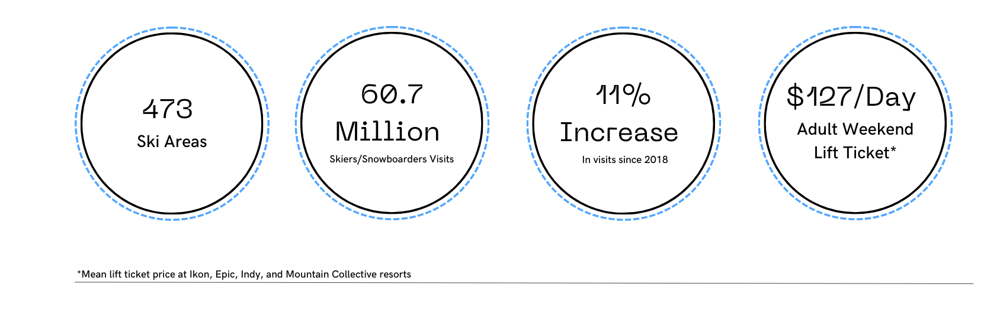
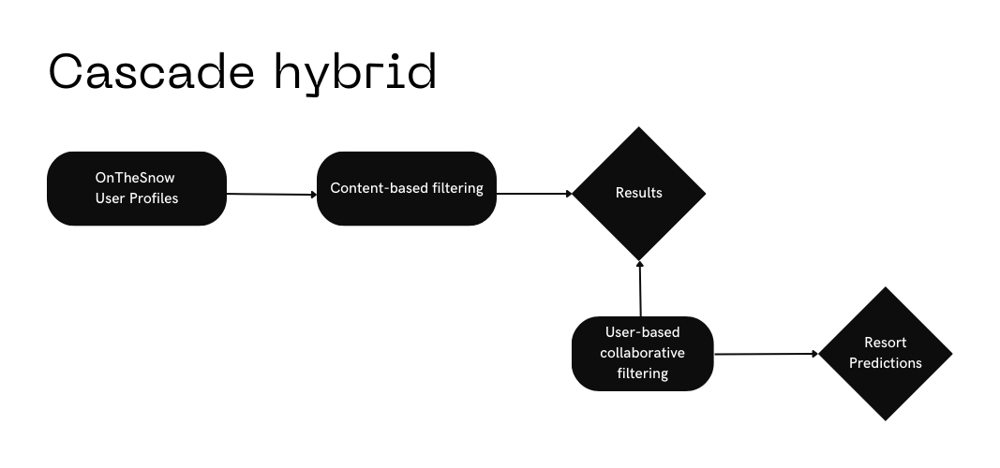
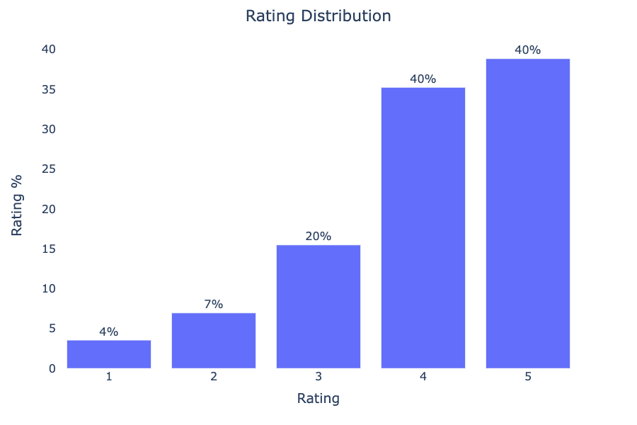
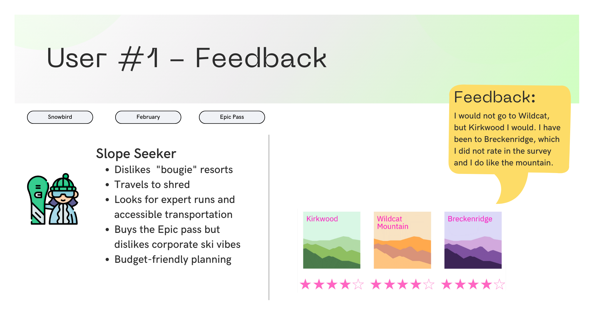
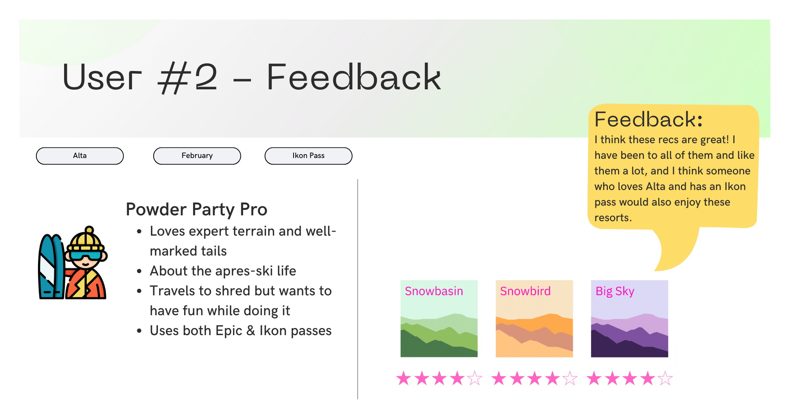

# Avant Ski 
### Ski Resort Recommendation App


**Author**:

Stephanie Ciaccia

## Overview

Skiing holds a prominent place for those seeking winter recreational activities in the United States. With its stunning mountain ranges and diverse terrain, the country boasts numerous ski resorts that cater to all skill levels, from beginners to seasoned professionals. Skiing offers a unique blend of adventure, physical activity, and natural beauty, making it a popular choice for winter enthusiasts seeking both relaxation and excitement.

The ski market in the United States is thriving, contributing significantly to the economy. According to the [National Ski Areas Association (NSAA)](chrome-extension://efaidnbmnnnibpcajpcglclefindmkaj/https://nsaa.org/webdocs/Media_Public/IndustryStats/Historical_Skier_Days_1979_2022.pdf), approximately **60.7 million** skiers and snowboarders visited **473** ski area in the 2021-2022 winter season.



## Business Problem

Skiing, an exhilarating winter sport cherished by many, often involves time-consuming and daunting trip planning. The sheer abundance of ski resorts available makes it overwhelming to choose the ideal destination, and existing ski websites lack the necessary tools to filter options based on individual preferences.

To address these challenges, I'm developing Avant Ski, a ski resort recommendation app. Avant Ski simplifies the ski resort selection process by leveraging data and user preferences. With dynamic filtering features, users can personalize their search based on budget, location, amenities, and skill level. By bridging the gap between ski enthusiasts and their dream destinations, Avant Ski makes skiing accessible to a wider audience, empowering them to plan unforgettable ski trips with confidence.

Since data plays a crucial role in this application, I plan to showcase the app to representatives from different ski resorts across the USA at the National Ski Area Association Winter Confernce. This presentation aims to foster partnerships and encourage resort feature sharing between Avant Ski and these resorts once the app is launched.

## Data

**User Data**

- OnTheSnow - For the collaborative system, I utilized a dataset sourced from Kaggle [Insider airbnb](http://insideairbnb.com/) with 30,000 reviews from OnTheSnow. As part of the data preparation process, it was essential to clean the user names in the dataset to establish accurate user profiles that truly reflect the preferences of individual users. 

This step played a vital role in ensuring the integrity of the dataset and facilitating the creation of a reliable foundation for the user-based recommendation system. By addressing non-unique user names and eliminating incorrect profiles, we could more effectively depict distinct users and their preferences. This cleaning resulted in a final dataset comprising **534 users, 269 resorts, and 2521 total reviews**

**Feature Data**

All feature data was scraped or pulled from an API:

- **Airbnb Scrape** - Includes Airbnb nightly costs from the first 28 listings for each ski resort from December - May

- **OnTheSnow Scrape** - Includes mountain feature characteristics for 300 resorts in the USA

- **Google's Geospatial API** - Pulled latitude and longitude coordinates from each ski resort

- **Google Forms Survey** - I sent out a [survey](https://forms.gle/PTv41GV71XyPREF26) to various friends who ski in order to analyze model recommendations. I received 15 responses and used two user responses for my final model evaluation.

## Methods

To create the recommender system, a cascade-hybrid recommender system approach was used. This is a two level system that benefits from two types of filtering. 

The primary recommendation system is a **content-based** filtering model and the secondary approach is **user-based collaborative** filtering.



The main features for content filtering are:
- mountain elevation
- mountain lift ticket price
- airbnb nightly cost for surrounding city
- run difficulty type and number of runs
- ski pass informaion (Ikon, Epic, Mountain Collective)

To evaluate the accuracy of the collaborative model, the Root Mean Square Error (RMSE) was used. This metric quantifies the difference between the actual ratings and the predicted ratings.

## Results

#### Collaborative Filtering

The best collaborative filtering model was a Singular Value Decomposition (SVD) model with a RMSE score of 0.90. While this score is relatively good considering the small size of the final dataset, there were instances where the results did not entirely correspond to previous user reviews. Potential factors contributing to this include user bias, rating distribution, and the limited size of the dataset. 



Considering the high opportunity cost associated with planning a ski trip, relying solely on a user-based system is insufficient to provide users with tailored recommendations that account for factors such as cost and time of year. While identifying similar users is crucial, it is essential to consider additional elements when making recommendations.

#### Cascade-Hybrid Model

The final model was the cascade-hybrid model that has been [deployed](https://stephcia-ski-recommendation-system-ski-model-stephanie-zs77j6.streamlit.app/) on streamlit. The system incorporated both content-based and collaborative filtering approaches in making ski-resort recommendations. To content-based system refined recommendations based on user filters and resort similarities and was crucial in making helpful recommendations. 

####  Feedback

To gain deeper insights into the recommendations, I sought feedback from two users who completed the resort survey and provided a brief overview of their mountain preferences. These users utilized the demo stremlit model to input their filters and review the recommendations.

Based on the user feedback, the recommendation system demonstrates does suggest ski resorts that align with user past reviews and preferences however not all recommendations were helpful.





## Conclusions

The recommendation system demonstrates strong performance in suggesting ski resorts that align with user inputs. Though, there are times when the output does not seem entirely alligned with the user preferences or former reviews. I believe this is due to the review datatset, being that not all resorts included in the content model were reviewed by users and due to the fact that users with 3 reviews were included in the dataset, and that there was an uneven distribution of ratings.

Though the results could use some fine tuning, the recommendation system utilizes collaborative filtering and content-based approaches to provide strong recommendations based on user preferences and resort characteristics. The cascade hybrid model returns resorts that are more in line with past user ratings, compared to the collaborative model alone. This is due to individual filtering and the similarity matrix that the content based system utilizes.

It is important to acknowledge that recommendations are inherently subjective, as they rely on individual preferences and the available dataset. To further enhance the system and ensure continuous optimization, user feedback is needed. By incorporating user feedback, the recommendations can be refined and the overall user experience improved, creating a more personalized system that caters to individual preferences.


## Next Steps

Next steps involve, expanding the dataset with additional user ratings and features, collecting first party data through ski resort partnerships, and deploying a web application:

- The OnTheSnow ratings dataset did not have unique user IDs for each rating, which reduced the number of reviews used to create the collaborative model. As a result, not all ski resorts in the USA were included. By incorporating more reviews, more mountains will be included in the collaborative filtering process which could result in more accurate recommendations.

- Once additional user ratings are collected, the cascade hybrid model will be fine-tuned and the main algorithms re-run.

- Finally, additional feature characteristics related to the resort towns and mountains will be incorporated. These features could include ratings and assessments of mountain restaurants, parking information, lodging options, après-ski activities, ski rentals, and other amenities available in the resort towns. By including these metrics in the recommendation system, a more comprehensive and personalized service can be provided, catering to diverse preferences and requirements, for a focus that is greater than skiing.

## For More Information

See the full analysis in the [Jupyter Notebook](https://github.com/stephcia/ski-recommendation-system/blob/main/ski_recommendation_cleaning.ipynb)

## Repository Structure

```
├── archive
├── data
    ├──scraping
    ├──kaggle
    ├──cleaned_data_exports
├── fonts
├── images
    ├──icons
├── scraping_notebooks
├── README.md
├── avant_ski_recommendation_system.pdf
├── environment.yml
├── gitignore.txt
├── model.pickle
├── requirements.txt
├── ski_recommendation_cleaning.ipynb
├── ski_recommendation_collaborative.ipynb
├── ski_recommendation_content_hybrid.ipynb