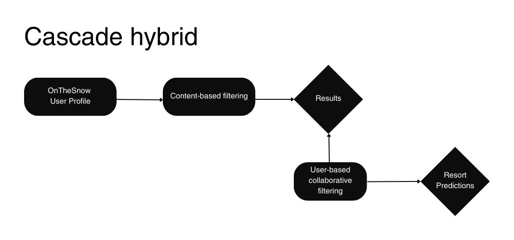

# Avant Ski
### Ski Resort Recommendation App


**Author**:

Stephanie Ciaccia

## Overview

Skiing holds a prominent place for those seeking winter recreational activities in the United States. With its stunning mountain ranges and diverse terrain, the country boasts numerous ski resorts that cater to all skill levels, from beginners to seasoned professionals. Skiing offers a unique blend of adventure, physical activity, and natural beauty, making it a popular choice for winter enthusiasts seeking both relaxation and excitement.

The ski market in the United States is thriving, contributing significantly to the economy. According to the [National Ski Areas Association (NSAA)](chrome-extension://efaidnbmnnnibpcajpcglclefindmkaj/https://nsaa.org/webdocs/Media_Public/IndustryStats/Historical_Skier_Days_1979_2022.pdf), approximately **60.7 million** skiers and snowboarders visited **473** ski resorts in the 2021-2022 winter season.

## Business Problem

Skiing, an exhilarating winter sport cherished by many, often involves time-consuming and daunting trip planning. The sheer abundance of ski resorts available makes it overwhelming to choose the ideal destination, and existing ski websites lack the necessary tools to filter options based on individual preferences.

To tackle these challenges head-on, I will be creating Avant Ski, a mobile ski resort recommendation app. Avant Ski will improve trip planning by harnessing the power of data and user preferences. The system will offer dynamic filtering capabilities, enabling users to personalize their search according to an array of desired features. By bridging the gap between ski enthusiasts and their dream destinations, Avant Ski aims to streamline the entire ski trip planning experience.

## Data

**User Data**

- OnTheSnow - For the collaborative system, I utilized a dataset sourced from Kaggle [Insider airbnb]([http://insideairbnb.com/) with 30,000 reviews from OnTheSnow. As part of the data cleaning process, I filtered out generic user names or those without last names. This filtering resulted in a final dataset comprising 664 users, 273 resorts, and 2801 total reviews.

**Feature Data**

- All feature data was scraped or pulled from an API:

- **Airbnb Scrape** - Includes Airbnb nightly costs from the first 28 listings for each ski resort from December - May

- **OnTheSnow Scrape** - Includes mountain feature characteristics for 300 resorts in the USA

- **Google's Geospatial API** - Pulled latitude and longitude coordinates from each ski resort

## Methods

To create the recommender system, a cascade-hybrid recommender system approach was used. This is a two level system that benefits from two types of filtering. 

The primary recommendation system is a **content-based** filtering model and the secondary approach is **user-based collaborative** filtering.



The main features for content filtering are:
- mountain elevation
- mountain lift ticket price
- airbnb nightly cost for surrounding city
- run difficulty type and number of runs
- ski pass informaion (Ikon, Epic, Mountain Collective)

To evaluate the accuracy of the collaborative model, the Root Mean Square Error (RMSE) was used. This metric quantifies the difference between the actual ratings and the predicted ratings.

## Results

The collaborative model with the highest performance achieved an RMSE score of 0.90. In order to assess the effectiveness of the recommender's predictions, an analysis was conducted on the results for three users. These users, including myself, provided their mountain and ski resort preferences for evaluation purposes.

*once streamlit is up and runnning, I'm hoping to send it to my friends so they can give me their honest feedback on the results

*will add in visuals and more specific details

## Conclusions

Based on the user analysis, the recommendation system demonstrates strong performance in suggesting ski resorts that align with user inputs. It effectively utilizes collaborative filtering and content-based approaches to provide tailored recommendations based on user preferences and resort characteristics.

It is important to acknowledge that recommendations are inherently subjective, as they rely on individual preferences and the available dataset. To further enhance the system and ensure continuous optimization, user feedback is needed. By incorporating user feedback, the recommendations can be refined and the overall user experience improved, creating a more personalized system that caters to individual preferences.

## Next Steps

Next steps involve deploying a web application, expanding the dataset with additional user ratings and features, and refining the hybrid model to enhance its performance.

- The OnTheSnow ratings dataset did not have unique user IDs for each rating, which reduced the number of reviews used to create the collaborative model. As a result, not all ski resorts in the USA were included. By incorporating more reviews, more mountains will be included in the collaborative filtering process which could result in more accurate recommendations.

- Once additional user ratings are collected, the cascade hybrid model will be fine-tuned and the main algorithms re-run.

- Finally, additional feature characteristics related to the resort towns and mountains will be incorporated. These features could include ratings and assessments of mountain restaurants, parking information, lodging options, après-ski activities, ski rentals, and other amenities available in the resort towns. By including these metrics in the recommendation system, a more comprehensive and personalized service can be provided, catering to diverse preferences and requirements, for a focus that is greater than skiing.

## For More Information

See the full analysis in the [Jupyter Notebook](https://github.com/stephcia/ski-recommendation-system/blob/Stephanie/ski_recommendation_collaborative.ipynb)

## Repository Structure

```
├── data
    ├──cleaned_data_exports
    ├──scraped_data
├── images
├── .gitignore
├── ski_resort_cleaning.ipynb
├── ski_resort_collaborative.ipynb
├── ski_resort_content_hybrid.ipynb
├── ski_resort_recommender. pdf
├── LICENSE
└── README.md